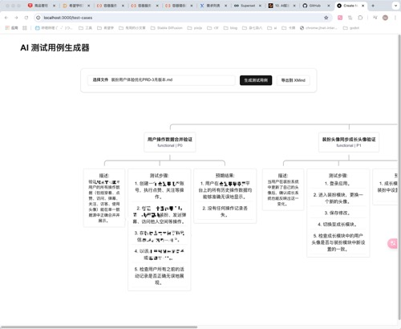

仿照 AI 提效金字塔模型，写了一个 AI 根据PRD生成测试用例的金字塔（可以导出xmind）

## 启动

创建 .env 或者 .env.local，设置环境变量：

```bash
OPENAI_API_KEY=你的API_KEY
OPENAI_BASE_URL=https://api.302.ai/v1/chat/completions
```

开启本地服务：

```bash
npm run dev
# or
yarn dev
# or
pnpm dev
# or
bun dev
```

Open [http://localhost:3000](http://localhost:3000) AI 提效金字塔模型.

`上传一个 md 格式的 PRD，去生成测试用例吧～`

Open [http://localhost:3000/test-cases](http://localhost:3000/test-cases) AI 根据PRD生成测试用例.


